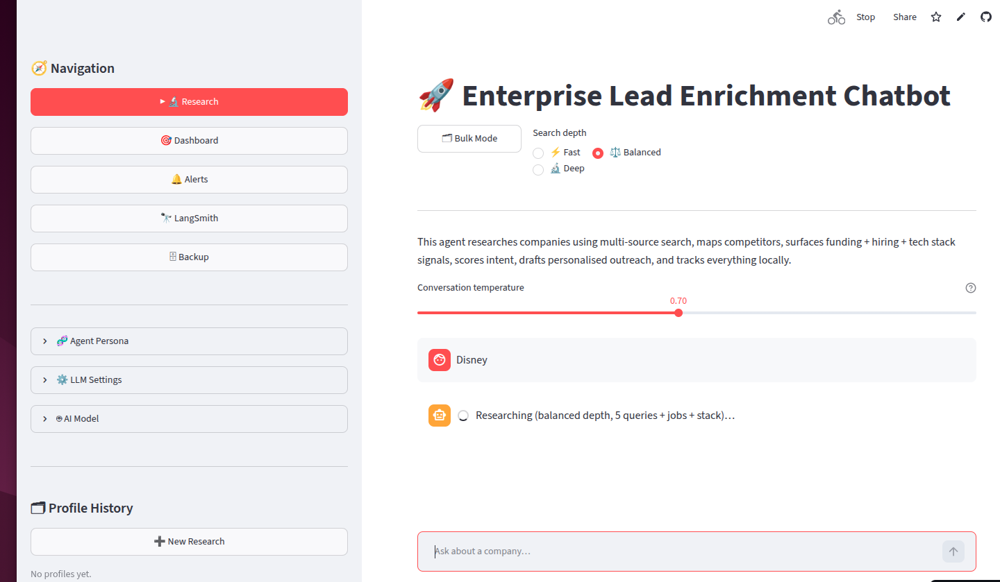

# 🚀 AI Sales Enrichment Agent

[](https://ai-agent-h6techvkibb4yfpcwdga7e.streamlit.app/)

## ✨ Live Preview



> A quick look at the Streamlit interface for research, model controls, and profile history.

A fully local, AI-powered sales intelligence platform that researches companies, maps competitors, surfaces funding and hiring signals, scores outreach intent, and drafts personalised cold emails — all from a single Streamlit app.

---

## What It Does

The agent takes a company name and runs a multi-source research pipeline across the open web (DuckDuckGo), then structures the results into actionable sales intelligence. Every profile is stored locally in SQLite and can be exported, re-researched, or used to generate outreach content — without ever sending your data to a third-party CRM or cloud database.

---

## Features

### 🔬 Research

**Multi-source company profiling**
Runs multiple targeted search queries per company in a single pass — news, funding, LinkedIn hiring signals, competitor landscape, customer reviews, tech stack, and leadership. Three depth modes let you trade speed for thoroughness:

| Mode | Queries | Best for |
|------|---------|----------|
| ⚡ Fast | 3 | Quick triage of a new lead |
| ⚖️ Balanced | 5 | Standard sales prep |
| 🔬 Deep | 8 | Enterprise account research |

**Structured output per company**
Every research run produces:
- Core product and business model summary
- Recent news, press releases, and announcements
- Key pain points (3–5 identified)
- Tailored sales pitch angle
- Per-field confidence badges (🟢 High / 🟡 Medium / 🔴 Low)

**💰 Funding & Financials tab**
Dedicated extraction of total raised, last funding round type and date, key investors, and revenue or headcount signals — all with confidence scoring.

**👥 Job Signals tab**
Dedicated job-posting searches identify open roles, infer hiring themes (e.g. "scaling data infrastructure"), estimate headcount, and translate the hiring patterns into a pitch implication.

**🛠 Tech Stack tab**
Infers tools, platforms, and frameworks the company uses from job postings, blog posts, and review sites — and suggests how to tailor the pitch based on their technical environment.

**🏆 Competitors tab**
Automatically identifies and fully profiles 2–3 direct competitors, each with their own product summary, recent news, pain points, pitch angle, and confidence scores.

**🗂 Bulk Mode**
Paste a list of company names (one per line) and enrich them all sequentially with a live progress bar. Results appear as cards and can be downloaded as CSV or Excel immediately.

---

### 🎯 Priority Dashboard

All saved companies are ranked by **intent score** — a hybrid signal that combines:

- **Rule-based scoring** (0–100): checks for funding mentions, known revenue signals, 3+ pain points, high-confidence data, deep research depth, competitor mapping, hiring signals, and tech stack coverage
- **LLM narrative layer**: the model reads the rule score and profile, then produces a 1–10 adjusted score plus a 2–3 sentence reasoning, a concrete recommended action, and a best-time-to-reach signal

Each card on the dashboard shows:
- Colour-coded intent badge (🔥 High / ⚡ Medium / ❄️ Low)
- Rule signal strength bar
- Triggered signals list
- Reasoning + recommended action side by side
- One-click jump to the full profile

Scores are cached in SQLite and only recomputed on demand.

---

### ✉️ Outreach Generation

Every profile card includes a full outreach suite accessible from an expandable panel:

**📧 Cold Email**
Generates a personalised cold email using the company's product, news, pain points, pitch angle, hiring signals, and tech stack. Three tone options: Formal, Friendly, Bold.

**🔁 Follow-up Sequence**
Generates a full 3-touch email sequence — intro, value-add, and break-up email — with suggested send gaps (Day 1 / Day 4 / Day 10).

**💼 LinkedIn DM**
A ≤300-character LinkedIn connection note optimised for the platform's character limit, with a live counter that turns red when over the limit.

**🛡 Objection Prep**
Generates the 3 most likely objections a prospect would raise, each paired with a sharp rebuttal. Designed to be reviewed before a discovery call.

**Draft storage and enhancement**
Every generated draft can be saved to SQLite. Saved drafts appear in a dropdown where you can:
- Preview the original
- Write free-text enhancement instructions ("make the opening more urgent, add a funding stat")
- Generate an improved version with a side-by-side diff view (green = added, amber = changed, red = removed)
- Save the enhanced version with full lineage back to the original

---

### 🔔 Trigger Alerts

Re-research any saved company on demand and see exactly what changed versus the previous profile:

- News updated
- Funding details changed
- New pain points identified
- Hiring themes shifted
- New tools detected in the tech stack

The diff is shown as a human-readable change list. The new profile is saved as a separate entry in history so you can track changes over time.

---

### 🧬 Agent Persona

A custom system prompt is always visible at the top of the sidebar and can be edited inline. Changes take effect on the next research run. A reset button restores the default prompt. The prompt is stored in SQLite so it persists across restarts.

---

### 🧠 Cross-session Memory

Every researched company is injected into the agent's system prompt as a compressed memory block before each new research run. The agent can draw comparisons, avoid repetition, and reference previously identified pain points across companies — without any manual context management.

---

### 📝 Notes & Activity Log

Each profile has a timestamped notes panel for logging call outcomes, follow-up dates, and rep observations. Notes are stored in SQLite and displayed chronologically.

---

### 📤 Export

**From the sidebar:**
- Export all profiles or a hand-picked selection via checkboxes
- CSV (flat, CRM-ready) or formatted Excel with colour-coded confidence columns and frozen header row

**From bulk mode:**
- Immediate download of the current batch as CSV or Excel

Both formats include all fields: core profile, confidence levels, funding data, job signals, tech stack, competitor names, search depth, and research date.

---

### 🔭 LangSmith Observability

All LLM calls and agent runs are automatically traced to LangSmith when credentials are configured. The in-app LangSmith page shows:

- Tracing status (active / inactive)
- Direct link to the LangSmith project dashboard
- Live KPIs: total runs, token usage, estimated cost, error count and error rate
- Per-operation breakdown (enrichment, job signals, tech stack, scoring, email generation, etc.)
- Current session ID for filtering traces in LangSmith

Key functions are decorated with `@traceable` and tagged by feature area (`step1`, `step2`, `enrichment`, `outreach`, `scoring`) for easy filtering.

---

### 🗄 Backup & Restore

- Create a timestamped local backup of the SQLite database with one click
- Download the current database as a `.db` file
- Restore from any previously downloaded `.db` file (auto-backs up before restoring)

---

## Tech Stack

| Layer | Technology |
|-------|-----------|
| UI | Streamlit |
| LLM | OpenRouter (default, free-tier models) + OpenAI + Perplexity + Ollama Cloud via LangChain |
| Agent framework | LangGraph (`create_react_agent`) |
| Web search | DuckDuckGo (`ddgs`) — free, no API key |
| Data storage | SQLite (local, zero config) |
| Observability | LangSmith |
| Export | openpyxl (Excel), csv (stdlib) |
| Resilience | tenacity (retry + exponential backoff) |
| Structured output | Pydantic v2 |

---

## Project Structure

```
.
├── main.py                       # Streamlit entrypoint (page config, session state, page router)
├── app/
│   ├── config.py                 # Constants, persona presets, search-depth queries, badge styles
│   ├── schemas/
│   │   ├── evidence.py           # FieldConfidence, FundingInfo, JobSignals, TechStack
│   │   └── profile.py            # CompanyProfile, CompetitorProfile
│   ├── db/
│   │   ├── models.py             # SQLite connection + init_db()
│   │   └── repository.py         # CRUD: profiles, settings, email drafts, notes
│   ├── llm/
│   │   ├── settings.py           # Provider / model / persona / prompt resolution
│   │   └── factory.py            # get_llm_client(), build_agent(), provider fallback
│   ├── tools/
│   │   └── web_search.py         # DuckDuckGo (ddgs) search tool with retry
│   ├── agents/
│   │   ├── enrichment_agent.py   # Multi-source research pipeline + structured extraction
│   │   ├── scoring_agent.py      # Rule-based + LLM intent scoring
│   │   ├── outreach_agent.py     # Cold email, follow-ups, LinkedIn DM, objection prep
│   │   └── verifier_agent.py     # diff_profiles + persona follow-up
│   ├── services/
│   │   ├── backup.py             # DB backup / restore
│   │   ├── export.py             # CSV / Excel / Markdown exporters
│   │   ├── memory.py             # Cross-company memory block builder
│   │   └── langsmith_client.py   # LangSmith stats fetcher
│   └── ui/
│       ├── badges.py             # Confidence + intent badges, diff renderer
│       ├── outreach_page.py      # Email expander widget
│       ├── profile_tabs.py       # 5-tab profile view + persona follow-up
│       ├── profiles_page.py      # Priority dashboard
│       ├── alerts_page.py        # Re-research / trigger alerts
│       ├── langsmith_page.py     # LangSmith observability page
│       ├── backup_page.py        # DB backup / restore page
│       ├── research_page.py      # Single-chat + bulk-enrichment page
│       └── sidebar.py            # Sidebar: nav, persona, LLM, model, history, export
├── requirements.txt              # Python dependencies
├── setup.py                      # First-time setup script
├── run.sh                        # Start script (macOS/Linux)
├── run.bat                       # Start script (Windows)
├── .env                          # API keys (created by setup.py, never commit this)
├── enrichment_profiles.db        # SQLite database (auto-created on first run)
└── db_backups/                   # Local database backups (auto-created)
```

The codebase follows a strict layered architecture: `config → schemas → db → llm → tools → agents/services → ui`. Only `app/ui/*` and `app/services/langsmith_client.py` (for `@st.cache_data`) import Streamlit; every other layer is UI-agnostic.

---

## Quick Start

**1. Run setup** (creates `.venv`, installs dependencies, and interactively builds `.env` from `.env.example`)
```bash
python setup.py
```

**2. Fill in `.env`**
```bash
# Required for default setup
OPENROUTER_API_KEY=sk-or-...
OPENROUTER_BASE_URL=https://openrouter.ai/api/v1

# Optional (only needed when selecting that provider)
OPENAI_API_KEY=sk-...
PPLX_API_KEY=pplx-...
OLLAMA_API_KEY=ollama-...
OLLAMA_INSECURE_SSL=true

# LLM backend (optional, defaults shown)
LLM_PROVIDER=openrouter  # openrouter | openai | perplexity | ollama
LLM_TIMEOUT=30
LLM_MODEL=openai/gpt-oss-120b:free
PPLX_BASE_URL=https://api.perplexity.ai
OLLAMA_BASE_URL=https://ollama.com

# Optional — enables LangSmith tracing
LANGSMITH_TRACING=true
LANGSMITH_API_KEY=ls__...
LANGSMITH_PROJECT=sales-enrichment-agent
```

You can select provider (`OpenRouter`, `OpenAI`, `Perplexity`, or `Ollama Cloud (Free Tier)`) and model from the app sidebar under `LLM Settings` and `AI Model`.
For OpenRouter, the curated model options are free-tier only and every model tag must end with `:free`, such as `openai/gpt-oss-120b:free`.

**3. Start the app**
```bash
./run.sh       # macOS / Linux
run.bat        # Windows
```

The app opens at **http://localhost:8501**.

---

## Manual Installation

If you prefer to manage the environment yourself:

```bash
python -m pip install -r requirements.txt
python -m streamlit run main.py
```

---

## Requirements

- Python 3.11+
- OpenRouter API key (default provider)
- Optional provider keys for OpenAI / Perplexity / Ollama if you switch provider
- Internet connection (for DuckDuckGo search and LLM calls)
- LangSmith account (optional, for observability)

---

## Data & Privacy

All data stays on your machine. The SQLite database (`enrichment_profiles.db`) is created in the project directory and never leaves your local environment. The only outbound connections are:

- **OpenRouter / OpenAI / Perplexity / Ollama Cloud** — LLM calls for research synthesis, scoring, and outreach generation (depends on selected provider)
- **DuckDuckGo** — web search queries (no account or API key required)
- **LangSmith API** — trace data, only if `LANGSMITH_TRACING=true` is set

---

## Keyboard Shortcuts & Tips

- **Search depth** is global — set it once at the top of the Research page and it applies to both single and bulk mode
- **Sidebar intent scores** — after scoring, the sidebar shows `[score/10]` next to each company name for at-a-glance prioritisation
- **Re-research** without losing history — the Alerts page always saves the new profile as a separate entry, so you keep a full timeline
- **Email lineage** — enhanced drafts store a `base_draft_id` so you can trace every iteration back to the original generated draft